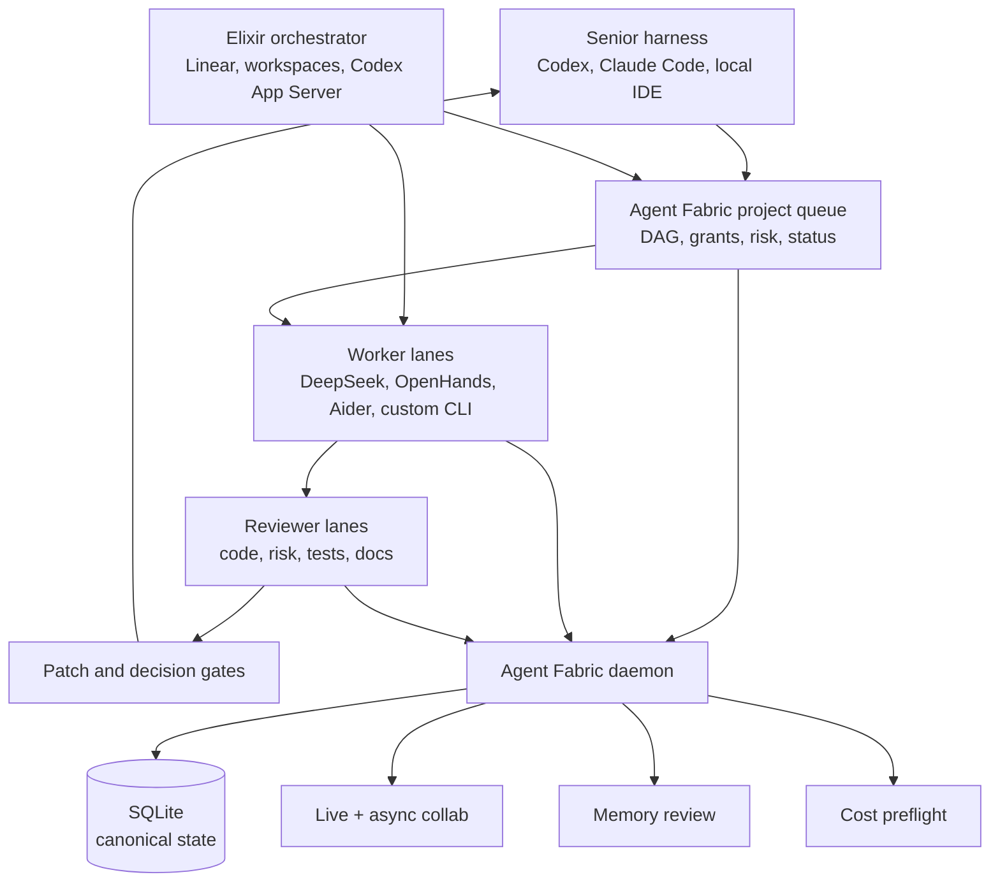

# Agent Fabric

Local-first coordination infrastructure for serious multi-agent software work.

Agent Fabric is a TypeScript daemon and CLI toolkit that gives coding agents a shared operating layer: durable queues, live collaboration, memory review, cost preflight, worker checkpoints, approval gates, and an auditable SQLite record of what happened.

It is built for developers who already use tools like Claude Code, Codex, OpenHands, Aider, OpenCode-style shells, local model runners, or custom workers, and want those tools to cooperate instead of starting over in isolated sessions.

## At a Glance

- **Use it when:** you have one strong supervisor harness and want multiple bounded worker/reviewer lanes without losing state, review, or cost visibility.
- **Do not use it for:** a hosted multi-tenant swarm platform, a model gateway replacement, or a coding agent runtime replacement.
- **Core idea:** keep execution in your existing tools, but put task state, collab, checkpoints, memory review, cost gates, and patch review in one local substrate.
- **Fastest way to understand it:** read the [2-minute demo script](docs/demo-script.md), inspect the [example task packet](docs/examples/task-packet.md), then run `npm test`.
- **Local/private setup:** keep private operating notes and preferences in ignored local files; see [Local Private Config And Agent Memory](docs/local-private-config.md).

## Why It Exists

Most agent tooling focuses on the runtime: prompts, personas, swarms, hooks, or a single IDE integration. Agent Fabric focuses on the missing substrate beneath those runtimes.

It answers operational questions that become painful as soon as more than one agent is involved:

- Which worker owns this task?
- Which files are claimed or risky to touch in parallel?
- What did the worker try before it crashed?
- Which prompt, model, and context package led to this cost?
- Which memories are trusted enough to inject again?
- Did a collaborator receive the handoff live, or should it read the durable inbox?
- Which generated patch has passed review and is safe to apply?

## What Makes It Different

Projects such as [Ruflo](https://github.com/ruvnet/ruflo) emphasize Claude-oriented orchestration, swarms, plugins, federation, and self-learning workflows. Agent Fabric takes a different position:

| Agent Fabric | Swarm-first orchestration projects |
|---|---|
| Runtime-agnostic substrate for many harnesses | Usually optimized around one runtime or ecosystem |
| SQLite-first durable state, queues, checkpoints, and audit rows | Often prompt/plugin/hook-first |
| Live plus async collaboration with durable inbox fallback | Often live coordination or chat without the same local database contract |
| Cost preflight, approval tokens, and coverage-honest ledgers | Cost tracking is often an add-on |
| Review-gated patch lanes and task packets | Worker output may be more directly applied |
| Senior-model supervisor mode for cheaper parallel worker depth | Expensive models often do more of the worker labor themselves |
| Local-first, single-developer control plane | Often designed as a broader swarm platform |

The point is not to replace agent runtimes. The point is to make them safer and more useful together.

## Senior Mode

Agent Fabric is designed for a practical cost-quality pattern: keep a premium "senior" model or harness in charge, then fan out cheaper high-context workers for breadth.

For example, a developer can run GPT-5.5 in Codex, Claude Opus 4.7 in Claude Code, or another top-tier model as the supervisor. That senior lane improves the prompt, splits the work, chooses which files and tools are safe to grant, and makes the final engineering judgment. It then uses Agent Fabric to launch many DeepSeek V4 Pro max-reasoning workers for planning variants, implementation slices, code review, risk review, test review, docs review, and adjudication.

The economic idea is simple: spend senior-model tokens on coordination and judgment, and spend DeepSeek tokens liberally on parallel depth. For large roadmap phases, the senior harness can use a manager-of-managers pattern: root senior supervises phase managers, phase managers supervise queue-visible DeepSeek/Jcode lanes, and the cheap workers do the token-heavy implementation, research, review, testing, and documentation work. Agent Fabric keeps that pattern controlled with:

- durable queues and task packets
- per-task worktree or report-only sandbox paths
- explicit file/tool/context grants
- bidirectional `collab_send` / inbox handoffs between the senior harness and worker lanes
- worker checkpoints and heartbeats
- review-gated patch application
- cost preflight and provider spend records
- normal-mode sensitive-context scanning, with Senior mode permissive worker context when `AGENT_FABRIC_SENIOR_MODE=permissive`
- final integration by the supervising harness, not blind worker output

Claude Code can therefore talk back and forth with DeepSeek workers instead of only launching one-way jobs. A Claude Code session can ask a DeepSeek lane for analysis, receive the durable reply or live SSE push, request a revision, send a reviewer finding, or hand an implementation result to another DeepSeek review lane. The same pattern works for Codex, OpenCode-style shells, local CLIs, and custom harnesses because the conversation is recorded in Agent Fabric rather than trapped in one tool.

This gives a single senior session leverage over a larger review-and-implementation factory without turning the workflow into an untracked swarm.

Senior mode is also an enforcement mode for local project work. When `AGENT_FABRIC_SENIOR_MODE=permissive` is set, `agent-fabric-project claim-next`, `launch`, `run-ready`, `factory-run`, and `senior-run` default to queue-backed `deepseek-direct` worker lanes with git worktree working directories, `deepseek-v4-pro:max`, and 10-way parallelism for broad ready/factory runs. Explicit 20-lane requests are supported, and the local caps are configurable up to 1000 with `AGENT_FABRIC_SENIOR_MAX_LANE_COUNT`, `AGENT_FABRIC_MAX_PARALLEL_AGENTS`, `AGENT_FABRIC_MAX_CODEX_AGENT_COUNT`, or the shared `AGENT_FABRIC_QUEUE_MAX_AGENTS` override. The cap env vars do not raise the launch default by themselves; set `AGENT_FABRIC_SENIOR_DEFAULT_LANE_COUNT` when the local default should intentionally exceed 10. Set `AGENT_FABRIC_SENIOR_DEFAULT_WORKER=jcode-deepseek` in local ignored config when large implementation lanes should use the Jcode runtime by default. Explicit non-DeepSeek execution workers, or command templates that record a DeepSeek worker while launching Codex/Claude/local CLIs, are rejected unless a human deliberately sets `AGENT_FABRIC_SENIOR_ALLOW_NON_DEEPSEEK_WORKERS=1` for a local fallback.

Senior DeepSeek direct runs also fail closed when they are not queue-visible. `run-ready`, `factory-run`, and `senior-run` inject `AGENT_FABRIC_WORKER_QUEUE_VISIBLE=1` plus queue/task/run ids into the worker shell; manual `agent-fabric-deepseek-worker run-task` calls in Senior mode are rejected unless `TASK_DIR` auto-queue registration is active or a human sets `AGENT_FABRIC_DEEPSEEK_ALLOW_UNTRACKED=1`. Generated DeepSeek task packets now include machine-readable frontmatter plus a bounded `.context.md` sidecar from `expectedFiles` and `requiredContextRefs`, so file-only DeepSeek lanes receive concrete source context instead of only filenames. Custom DeepSeek command templates that invoke `agent-fabric-deepseek-worker` are automatically linked with `--fabric-task {{fabricTaskId}}`.

The cheap happy path for Codex and Claude Code is:

```bash
AGENT_FABRIC_SENIOR_MODE=permissive \
agent-fabric-project senior-doctor --project <path>

AGENT_FABRIC_SENIOR_MODE=permissive \
agent-fabric-project senior-run \
  --project <path> \
  --tasks-file .agent-fabric/tasks/tasks.json \
  --count 10 \
  --worker deepseek-direct \
  --approve-model-calls \
  --progress-file .agent-fabric/progress.md
```

`senior-run --dry-run` previews the queue/task/card shape without creating workers. If only an MD plan exists, `senior-run` creates a small local queue scaffold by default rather than spending a senior/project-model call on task expansion. Lower-level `factory-run` remains available for explicit queue runs and now supports `--approve-model-calls` for one audited queue-scoped DeepSeek approval token. This is the required path for "Senior mode with 10 DeepSeek lanes" or explicit 20-lane requests. Built-in worker pools or ad hoc side agents do not count as Agent Fabric worker lanes unless they are registered through the queue and visible in `lanes` or the desktop dashboard.

`senior-doctor` checks the target project, DeepSeek auth, daemon/source parity, and Senior bridge tool availability before launch. If Codex creates a queue for `--project <path>`, Claude Code and `agent-fabric-project --project <path> --queue <id>` can resume it even when their host workspace roots differ. For non-git folders, report-only planner/reviewer lanes should use `sandbox`; mutating lanes still require `git_worktree`.

Codex and Claude Code should use the compact bridge facade when they want native-feeling background workers: `fabric_senior_start`, `fabric_senior_status`, `fabric_senior_resume`, `fabric_spawn_agents`, `fabric_list_agents`, `fabric_open_agent`, `fabric_message_agent`, `fabric_wait_agents`, and `fabric_accept_patch`. These return Codex-style `@af/<name>` worker cards while Agent Fabric remains the durable source of truth. Cards include runner process state, pid, last heartbeat, packet/context paths, log path, launch source, and manager/phase/workstream metadata when runner evidence exists. `fabric_list_agents` supports pagination and grouping so managers can supervise hundreds of lanes without flooding their context. `fabric_spawn_agents` must not create runnerless running cards; it returns planned cards and a `run-ready` action when a shell runner is still required. Patch acceptance requires senior review metadata.

`fabric_status` is bounded by default and accepts `includeSessions`, `sessionLimit`, `sessionOffset`, and `dedupeWarnings` when a harness needs deeper diagnostics without flooding the context window.

Project CLI JSON output redacts approval/session token fields before printing. Use the in-process approval object only inside the current command invocation; do not copy tokens from logs or transcripts.

Finished Senior queues can be cleaned with a dry-run-first retention command so old queue rows do not build up in active surfaces:

```bash
agent-fabric-project cleanup-queues --project <path> --older-than-days 7 --json
agent-fabric-project cleanup-queues --project <path> --older-than-days 7 --apply --json
```

Cleanup only targets completed or canceled queues. The default pass deletes queue-owned database rows but preserves linked worker task history, checkpoints, logs, and patch artifacts for audit; use `--delete-linked-task-history` only for an intentional deeper compaction pass.

## Current Capabilities

- **Collaboration:** `collab_send`, inbox reads, asks/replies, decisions, path claims, live SSE fan-out, and durable fallback.
- **Project queues:** dependency-aware task DAGs, concurrency gates, risk buckets, task packets, ready queues, retries, stale-worker recovery, dry-run-first cleanup, review matrix, and patch review.
- **Worker lifecycle:** task creation, start, heartbeat, events, checkpoints, resume packets, and finish records.
- **Codex-style worker bridge:** `fabric_senior_start`, `fabric_senior_status`, `fabric_senior_resume`, `fabric_spawn_agents`, `fabric_list_agents`, `fabric_open_agent`, `fabric_message_agent`, `fabric_wait_agents`, and `fabric_accept_patch` expose queue-visible workers as `@af/<name>` background-agent cards with process-evidence based state.
- **Memory:** typed memories, pending-review promotion, confirmations, invalidation, outcome reporting, and guarded injection.
- **Cost control:** model preflight, budget checks, approval tokens, context inspection, provider spend ingestion, anomaly detection, and coverage reporting.
- **Command center:** local browser console over the same daemon APIs for queues, approvals, lanes, memory review, and patch review.
- **DeepSeek side lanes:** optional direct DeepSeek worker adapter for high-context planning, implementation, review, risk review, and adjudication tasks, with normal-mode sensitive-context scanning and Senior-mode permissive context when enabled.
- **Elixir orchestration preview:** additive OTP modules can parse `WORKFLOW.md`, normalize Linear issues, prepare deterministic workspaces, supervise Codex App Server style runners, and report lifecycle state back to the TypeScript daemon.
- **MCP bridge:** stdio MCP surface so IDEs and harnesses can call Agent Fabric tools.

## Architecture



SQLite is canonical. Generated views, SSE pushes, and worker packets are projections over durable state.

## Local Private Config And Agent Memory

Use one checkout as the active Agent Fabric development tree. Keep source,
tests, API docs, and public examples there. Do not maintain a second active
private source copy unless you are intentionally testing migration or sync
logic.

Personal operating material can still live in this checkout, but it is ignored
by Git:

- `agent-fabric.local.env` for local environment defaults and private harness
  preferences.
- `decisions/` for local architecture intent and roadmap notes that agents
  should read when present.
- `.agent-fabric-local/` and `artifacts/` for generated local working state.

Runtime state belongs under `~/.agent-fabric`. If a local decision or note
should become public, import it one file at a time after scrubbing local paths,
secrets, provider account details, and personal workflow assumptions.

## Quick Start

Agent Fabric requires Node.js 24+ because it uses `node:sqlite`.

```bash
npm install
npm run build
npm test
```

Start the daemon:

```bash
AGENT_FABRIC_COST_INGEST_TOKEN="$(openssl rand -base64 32)" npm run dev:daemon
```

Check local Codex/Claude/Agent Fabric wiring without starting the daemon:

```bash
agent-fabric doctor local-config --project /path/to/agent-fabric
```

If you do not need the HTTP cost-ingest and SSE endpoints, disable HTTP:

```bash
AGENT_FABRIC_HTTP_PORT=off npm run dev:daemon
```

In another shell:

```bash
npm run dev:sim -- status
npm run dev:sim -- doctor
```

Start the local command center:

```bash
npm run dev:desktop -- --port 4573
```

Open `http://127.0.0.1:4573/`.

The desktop API includes `/api/queues/<queueId>/health`, which returns the same bounded manager summary, next actions, verification checklist, and queue evidence used by Senior-mode progress reports. This is the preferred monitoring shape for manager dashboards and native integrations that need health without raw transcript replay.

## Typical Workflow

Create a queue:

```bash
npm run dev:project -- create \
  --project /path/to/project \
  --prompt-file prompt.md \
  --profile careful \
  --max-agents 4
```

Generate and review work:

```bash
npm run dev:project -- start-plan --queue <queueId> --task-file prompt.md
npm run dev:project -- generate-tasks --queue <queueId> --plan-file accepted-plan.md --tasks-file tasks.json
npm run dev:project -- review-queue --queue <queueId> --approve-queue
npm run dev:project -- decide-queue --queue <queueId> --decision start_execution
```

Run ready tasks:

```bash
npm run dev:project -- run-ready \
  --queue <queueId> \
  --parallel 4 \
  --workspace-mode git_worktree \
  --cwd-template "/tmp/agent-fabric-worktrees/{{queueTaskId}}" \
  --task-packet-dir task-packets \
  --command-template "your-worker --task-packet {{taskPacket}}" \
  --approve-tool-context
```

Review proposed patches:

```bash
npm run dev:project -- review-patches --queue <queueId>
npm run dev:project -- review-patches --queue <queueId> --accept-task <queueTaskId> --apply-patch
```

## Optional DeepSeek Worker

For broad tasks, Agent Fabric can delegate planning, implementation, review, risk review, and adjudication to DeepSeek through a direct worker adapter.

```bash
# Ensure DEEPSEEK_API_KEY is already exported in your shell or secret manager.
export AGENT_FABRIC_PROJECT_MODEL_COMMAND="agent-fabric-deepseek-worker model-command --model deepseek-v4-pro --reasoning-effort max"
```

Then run queue lanes with:

```bash
npm run dev:project -- run-ready \
  --queue <queueId> \
  --worker deepseek-direct \
  --parallel 4 \
  --workspace-mode git_worktree \
  --task-packet-dir task-packets \
  --approve-tool-context
```

The DeepSeek worker rejects task packets that appear to include secrets in normal mode unless explicitly overridden. In Senior mode, set `AGENT_FABRIC_SENIOR_MODE=permissive` so task-relevant sensitive context is allowed for DeepSeek-direct workers by default.

Use `--worker jcode-deepseek` when a queue task should run through a Jcode DeepSeek runtime instead of the direct API adapter. The default path uses the bundled `agent-fabric-jcode-deepseek-worker` adapter and `JCODE_BIN` (default `jcode`). Agent Fabric wraps the lane with queue-visible heartbeats, structured timeout failure handling, and patch artifact capture. `AGENT_FABRIC_JCODE_DEEPSEEK_DISPATCHER` remains only as a legacy/private override; see [workers/jcode-deepseek](workers/jcode-deepseek/README.md). Do not use manual `nohup jcode ...` for Senior lanes; it bypasses queue lifecycle and review gates.

See [docs/examples/worker-result.json](docs/examples/worker-result.json) for the structured result shape Agent Fabric expects from sidecar workers.

## Demo and Feedback

- [2-minute demo script](docs/demo-script.md)
- [Example task packet](docs/examples/task-packet.md)
- [Example worker result](docs/examples/worker-result.json)
- [Copy-ready team post](docs/public-feedback-post.md)
- [Elixir OTP hybrid orchestrator](elixir/README.md) — OTP supervisory layer running alongside the TypeScript daemon

Useful feedback right now:

- Does the supervisor-to-worker-to-reviewer loop match how you actually use coding agents?
- Which surfaces should be protocol-first: MCP, CLI, HTTP, or file packets?
- What is the smallest quickstart that would convince you to try it locally?
- Which safety gates feel essential, and which ones are friction?

## Repository Map

| Path | Purpose |
|---|---|
| `src/` | daemon, server, surfaces, CLI, MCP bridge, command center server |
| `src/migrations/` | SQLite schema migrations |
| `test/` | Vitest coverage for daemon, queues, collab, cost, memory, workers, desktop, and DeepSeek adapter |
| `api/` | public tool surface notes |
| `pillars/` | design notes for collaboration, memory, and cost pillars |
| `workers/` | optional worker adapters |
| `elixir/` | Elixir OTP hybrid orchestrator layer (supervision, lane management; TypeScript daemon is canonical) |

Local ignored files may include `agent-fabric.local.env`, `decisions/`,
`.agent-fabric-local/`, and generated `artifacts/`. Agents should read local
`decisions/` when it exists, but public docs and tests must not require it.

## Safety Model

- Mutating tools require authenticated sessions and idempotency keys.
- Messages are inserted durably before live fan-out is attempted.
- Live fan-out is best-effort; the durable inbox remains the source of truth.
- Worker patches are reviewed before application.
- Model calls can be preflighted and gated by approval tokens.
- Cost and context records are stored as sanitized metadata, not raw prompt dumps.
- Sensitive worker packets are scanned before leaving the machine.

## Status

This is an early but working local-first implementation. The test suite covers the current daemon and CLI surfaces, including live collaboration fan-out, project queues, worker lifecycle, approval gates, memory review, cost preflight, and patch review.

| Area | Status |
|---|---|
| Local daemon, SQLite schema, UDS/MCP bridge | Working |
| Collaboration inbox, asks/replies, live SSE fan-out | Working |
| Project queues, task packets, worker checkpoints | Working |
| Patch review and guarded apply flow | Working |
| Cost preflight, approvals, context inspection | Working |
| Memory review and guarded memory injection | Working |
| Browser command center | Working, early UI |
| DeepSeek direct sidecar worker | Working, optional |
| Elixir OTP hybrid orchestrator layer | Preview, early |
| Cross-machine sync | Future |
| Hosted multi-user service | Non-goal |

Known limitations:

- It is not a multi-tenant service.
- Live fan-out acknowledgements mean the daemon accepted the event, not that a human or agent processed it.
- Cross-machine sync and hosted deployment are future work.
- The command center is intentionally local and utilitarian.

## License

MIT. See [LICENSE](LICENSE).
